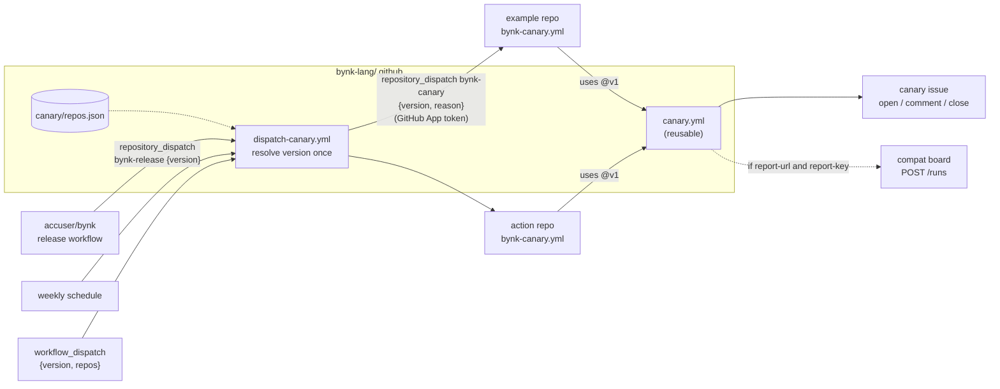

# The Bynk canary

The canary re-runs the checks of every enrolled Bynk example repository, and
every enrolled action repository, against a Bynk release. When a release breaks
one, it opens an issue there, and closes the issue again once the canary passes.

## How it fits together



| Part | What it does |
| --- | --- |
| [`repos.json`](repos.json) | The registry: every enrolled repository and its `kind` (`example` or `action`). Validated against [`repos.schema.json`](repos.schema.json) on every pull request. |
| [`dispatch-canary.yml`](../.github/workflows/dispatch-canary.yml) | The one central trigger. It resolves `latest` to an exact version **once**, so every repository tests the same release, then sends each one a `bynk-canary` `repository_dispatch`. A failed dispatch doesn't stop the rest; every result goes in the job summary, and the run fails at the end if any dispatch failed. |
| [`bynk-canary.yml`](../workflow-templates/bynk-canary.yml) (starter workflow) | What each enrolled repository adds. It listens for `bynk-canary` (and `workflow_dispatch`), and calls `canary.yml`. It has no `schedule` of its own. |
| [`canary.yml`](../.github/workflows/canary.yml) | The reusable workflow. It resolves the version with `setup-bynk`, runs `bynk-ci` and/or a `bynk-deploy` dry run at that exact version, then a result job opens, updates or closes the `canary` issue ([`scripts/issue.sh`](scripts/issue.sh)) and sends the optional report ([`scripts/report.sh`](scripts/report.sh)). Its outputs are `result` (`pass` or `fail`) and `bynk-version`. |

### Issues

On failure (with `open-issue`, the default), the result job opens an issue
labelled `canary` called **Canary: fails with Bynk \<version\>**, creating the
label if it is missing. If a `canary` issue is already open, it comments on that
issue instead, so there is one issue per break, not one per run. On the next
pass it comments that the canary passes with the new version and closes the
issue. All of this goes through `gh api` and REST endpoints only.

### `canary.yml` inputs

| Input | Default | |
| --- | --- | --- |
| `version` | `latest` | Exact (`0.303.4`) or `latest`. |
| `working-directory` | `.` | The project root (holds `bynk.toml`). |
| `source` | `src` | Passed to `bynk-ci`. Use `.` for a project with a `tests/` directory: `bynkc test src` does not see `tests/`. |
| `ci` | `true` | Run `bynk-ci`. |
| `format` | `true` | Run `bynk-ci`'s format check. See [the caveat](#bynk-ci-and-directories) below. |
| `deploy-dry-run` | `false` | Also run `bynk-deploy@v2` with `dry-run: "true"`. This is offline, so it needs no Cloudflare credentials. |
| `open-issue` | `true` | Manage the `canary` issue. |
| `kind` | `example` | The repository's kind in `repos.json`, sent in the report. |
| `fail-run` | `true` | Fail the run when the checks fail. The self-test turns it off for its deliberately broken fixture. |
| `canary-ref` | `v1` | The ref of this repository to take `scripts/` from. A reusable workflow cannot see the ref it was called at, so keep this in step with the `@ref` you call. |

The secrets `report-url` and `report-key` are both optional.

The caller must grant `contents: read` and `issues: write`, even with
`open-issue: false`, because the result job asks for them.

### bynk-ci and directories

`bynk-ci@v1` passes `source` to `bynkc fmt --check`, and `bynkc fmt` takes files
only: given a directory it fails with "Is a directory". That happens with every
release tried (0.245.0, 0.290.0 and 0.303.4), not just new ones. Until `fmt`
walks directories ([accuser/bynk#1753](https://github.com/accuser/bynk/issues/1753)),
the canary and Bynk CI starter workflows turn the format check off.

## Enrolling a repository

1. **Add the starter workflow.** In the repository, open Actions → New workflow
   and choose **Bynk canary** (or copy
   [`workflow-templates/bynk-canary.yml`](../workflow-templates/bynk-canary.yml)).
   Set `kind`, `source`, `working-directory` and `deploy-dry-run` to suit the
   repository, and commit it to the **default branch**:
   `repository_dispatch` only runs workflows there.
2. **Add a registry entry** to [`repos.json`](repos.json) in a pull request here:

   ```json
   { "repo": "bynk-lang/compat-board", "kind": "example", "description": "Compat board" }
   ```

3. **Install the canary App on the repository** (org settings → GitHub Apps →
   the canary App → Configure → Repository access). Without it, the dispatch
   fails with a 404 that names the repository.

Then run the dispatcher by hand for just that repository (below) and check that
a run appears in its Actions tab. A dispatch that returns success only means
GitHub accepted the event. If nothing runs, the workflow is not on the default
branch or does not listen for `bynk-canary`.

## The GitHub App

`GITHUB_TOKEN` cannot send `repository_dispatch` to another repository, so the
dispatcher uses a GitHub App installation token
([`actions/create-github-app-token`](https://github.com/actions/create-github-app-token)).

1. Create an App owned by `bynk-lang` with **Repository permissions →
   Contents: Read and write** and nothing else (Metadata: Read is added
   automatically). It needs no webhook, no events and no user permissions.
2. Install it on the org, with access to **only the enrolled repositories**.
3. Set two secrets on `bynk-lang/.github`:
   - `CANARY_APP_ID`: the App's **Client ID** (recommended) or its numeric App
     ID. Either works, because the action passes it on as the JWT issuer.
   - `CANARY_APP_PRIVATE_KEY`: a private key generated for the App (the whole
     PEM).

The dispatcher asks for a token with `contents: write` only, and fails with a
clear error if either secret is missing. If there are no targets (an empty
registry, say), it doesn't need the App at all.

## The 60-day rule

GitHub disables scheduled workflows in a public repository after 60 days
without repository activity. Example repositories rarely change, so none of them
runs its own cron: they are all triggered by `repository_dispatch`, which that
rule does not cover.

The dispatcher's weekly `schedule` **is** subject to the rule, because this
repository changes rarely too. After 60 quiet days GitHub will disable it, and
someone has to re-enable it in the Actions tab. That is acceptable, because the
schedule is only a backstop. The durable trigger is the `bynk-release` dispatch
that `accuser/bynk`'s release workflow will send on every release. That is a
separate change, and until it lands the weekly schedule and manual runs are the
only triggers. There are no keep-alive commits.

`accuser/bynk` will send:

```sh
gh api -X POST repos/bynk-lang/.github/dispatches \
  -f event_type=bynk-release -f 'client_payload[version]=0.304.0'
```

with a token that has Contents: write on `bynk-lang/.github`.

## Running it by hand

Every enrolled repository, against the latest release:

```sh
gh workflow run dispatch-canary.yml -R bynk-lang/.github
```

One repository, against an exact version:

```sh
gh workflow run dispatch-canary.yml -R bynk-lang/.github -f version=0.303.4 -f repos=bynk-lang/bynk-deploy
```

Or skip the dispatcher and run one repository's canary directly:

```sh
gh workflow run bynk-canary.yml -R bynk-lang/bynk-deploy -f version=latest
```

## Reporting

When a caller passes both `report-url` and `report-key`, the result job POSTs a
signed JSON result to the compat board. The payload and the HMAC-SHA256
signature scheme (which matches Bynk's `Signature` actor) are specified in
[`REPORTING.md`](REPORTING.md). Without both secrets, reporting is skipped
silently, and a failed report is only a warning.

## Tests

- [`ci.yml`](../.github/workflows/ci.yml) validates `repos.json` (schema, and
  each `repo` once), runs actionlint on every workflow and starter template, and
  shellchecks and unit-tests the scripts ([`test/run.sh`](test/run.sh), with
  `gh` and `curl` replaced by fakes in [`test/bin/`](test/bin)).
- [`canary-self-test.yml`](../.github/workflows/canary-self-test.yml) calls
  `canary.yml` from the same commit against [`test/fixture/`](test/fixture),
  which has one context and one test. It runs at a pinned version (with the
  deploy dry run) and at `latest`, and once with `source: broken`, which has a
  deliberate type error and must report `fail`.
